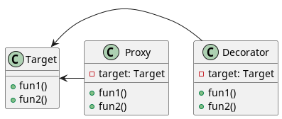
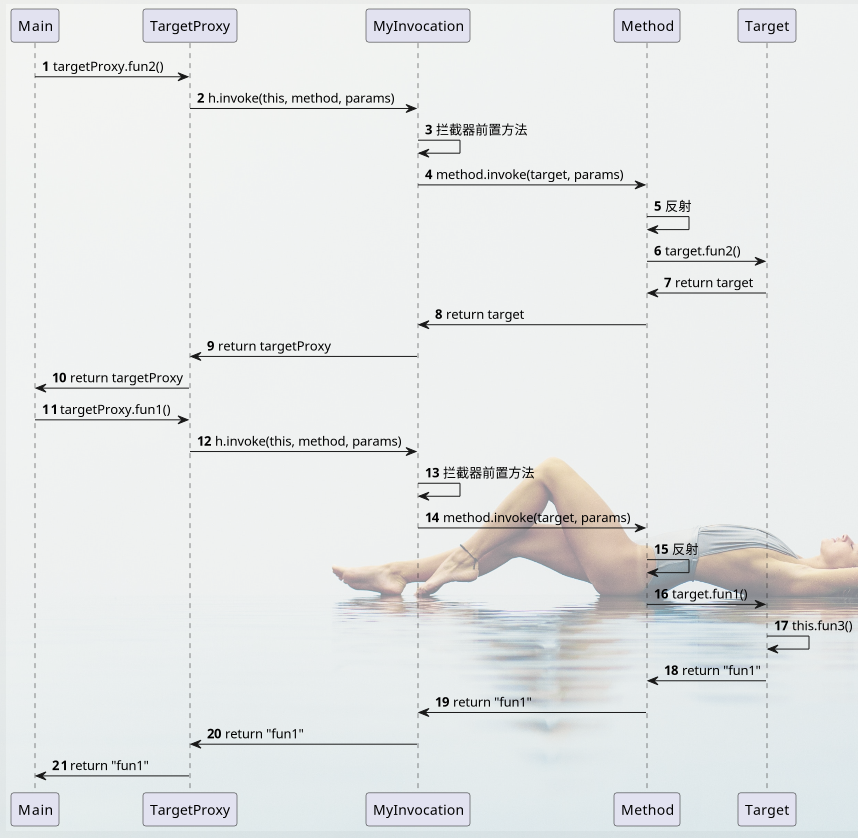
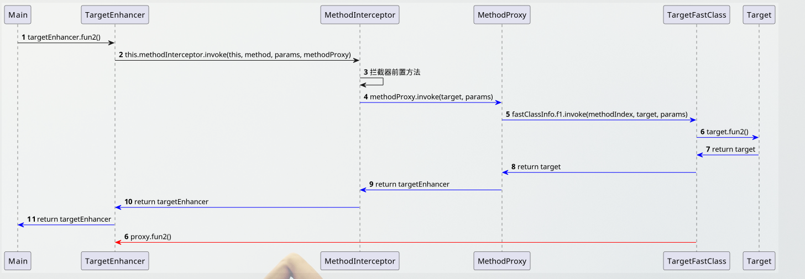

[TOC]

# 与装饰者模式的区别



​	从实现的角度来说是一样的，都是增加**被代理对象**的能力。

​	目的不一样，**装饰者模式**侧重增强**被代理对象**相关的业务，**代理模式**侧重增强与**被代理对象**无关的业务。

**根据业务的不同叫法不同是为了便于理解，不要过于纠结，本质都是增强原对象能力**

​	静态代理也可以叫静态装饰者，动态代理也可以叫动态装饰者。

# 接口是必要的吗

​	按照设计模式的uml图，不论是代理模式还是装饰者模式，它们都实现了和**被代理对象**相同的接口。

​	其实如果**被代理对象**没有实现任何接口，我们依然可以代理或者装饰它，所以接口是**不必要的**。

​	当然如果**被代理对象**实现了接口，**代理类**最好也实现相同的接口，这样更容易保证代理类与被代理类方法的**一致性**。

# 被代理类

为了测试，我们先设计一个被代理类Target，关注点是**this的指向**的问题。

```java
/**
 * 被代理类
 */
public class Target {

    public String fun1(String param) {
        System.out.println("fun1:" + this);
        // 测试代理类测试内部调用，fun3会走代理吗？
        this.fun3();
        return param;
    }

    public Target fun2() {
        System.out.println("fun2:" + this);
        // 测试代理类的链式调用，返回的是代理还是这个对象？
        return this;
    }

    public void fun3() {
        System.out.println("fun3:" + this);
    }

}
```

```java
public static void main(String[] args) {
    Target target = new Target();
    target.fun2().fun1("hello");
}
```

运行main方法控制台输出

```shell
fun2:com.yqz.proxy.example.Target@7637f22
fun1:com.yqz.proxy.example.Target@7637f22
fun3:com.yqz.proxy.example.Target@7637f22
```

# 静态代理

## 特点

- 叫静态的原因：在编译期间创建代理类。
- 可以方便的为被代理对象的每个方法提供不同的操作。

## 应用场景

​	需要使用原始对象的功能，在不方便修改原始对象的情况下对原始功能增强，并且每个方法增强的方式不同。

## 静态代理实现1：持有被代理对象

```java
/**
 * 静态代理实现类
 */
public class StaticProxy {

    /**
     * 被代理对象
     */
    private Target target = new Target();

    public String fun1(String param) {
        System.out.println("do something before fun1");
        return target.fun1(param);
    }

    public StaticProxy fun2() {
        System.out.println("do something before fun2");
        target.fun2();
        return this;
    }

    public void fun3() {
        System.out.println("do something before fun3");
        target.fun3();
    }

}
```

```java
public static void main(String[] args) {
    StaticProxy staticProxy = new StaticProxy();
    staticProxy.fun2().fun1("hello");
}
```


控制台输出

```shell
do something before fun2
fun2:com.yqz.proxy.example.Target@4926097b
do something before fun1
fun1:com.yqz.proxy.example.Target@4926097b
fun3:com.yqz.proxy.example.Target@4926097b
```

​	观察输出发现，在fun1内部调用fun3没有走代理，因为this的指向是target。

​	如果想要fun1的执行者变成代理对象可以通过继承的方式。

## 静态代理实现2：继承被代理对象

```java
/**
 * 静态代理实现类
 */
public class ExtendStaticProxy extends Target{

    public String fun1(String param) {
        System.out.println("do something before fun1");
        return super.fun1(param);
    }

    public ExtendStaticProxy fun2() {
        System.out.println("do something before fun2");
        super.fun2();
        return this;
    }

    public void fun3() {
        System.out.println("do something before fun3");
        super.fun3();
    }

}
```

```java
public static void main(String[] args) {
    ExtendStaticProxy staticProxy = new ExtendStaticProxy();
    staticProxy.fun2().fun1("hello");
}
```

控制台输出

```shell
do something before fun2
fun2:com.yqz.proxy.example.staticproxy.ExtendStaticProxy@4926097b
do something before fun1
fun1:com.yqz.proxy.example.staticproxy.ExtendStaticProxy@4926097b
do something before fun3
fun3:com.yqz.proxy.example.staticproxy.ExtendStaticProxy@4926097b
```

​	观察输出发现，在fun1内部调用fun3也走代理，因为this的指向是代理类。

​	**this的指向就是继承方式和关联方式的区别。**

# 动态代理

## 特点

- 运行期间创建代理对象。
- 可以通过拦截器统一控制方法。

## 应用场景

​	对原始对象的每个方法有统一的增强方式，也就是拦截器功能。

## 静态代理实现拦截器

```java
/**
 * 静态代理实现拦截器
 *
 * 缺点：每个方法需要写一样的代码
 */
public class StaticInterceptor {

    private Target target = new Target();

    public String fun1(String param) {
        doSomeThingBefore();
        return target.fun1(param);
    }

    public StaticInterceptor fun2() {
        doSomeThingBefore();
        Target target = this.target.fun2();
        return this;
    }

    public void fun3() {
        doSomeThingBefore();
        this.target.fun3();
    }

    private void doSomeThingBefore() {
        System.out.println("do something before");
    }
}
```

​	观察上面方法，每个方法前面都需要添加doSomeThingBefore方法，如果**被代理类**增减了方法，那么代理类需要跟着改变。

​	动态代理就是解决手动修改代码的问题，在程序运行中根据**被代理类**和**定义好的拦截器**生成**代理类**

# jdk动态代理

## 特点

- 被代理类需要实现接口，只能代理接口定义的方法。
- 每次方法调用是通过Method.invoke反射的方式调用，方法的执行效率比较低。

## 定义接口

```java
public interface Intfs {

    String fun1(String param);

    Intfs fun2();

    void fun3();

}
```

## 实现接口

被代理类实现接口

```java
public class TargetWithInterface implements Intfs {

    @Override
    public String fun1(String param) {
        System.out.println("fun1:" + this);
        this.fun3();
        return param;
    }

    @Override
    public Intfs fun2() {
        System.out.println("fun2:" + this);
        return this;
    }

    public void fun3() {
        System.out.println("fun3:" + this);
    }

}
```

## 拦截器

```java
public class MyInvocation implements InvocationHandler {

    private Intfs target = new TargetWithInterface();

    @Override
    public Object invoke(Object proxy, Method method, Object[] args) throws Throwable {
        System.out.println("jdk: do something before method");
        Object result = method.invoke(this.target, args);
        // 如果返回的是“被代理类对象”那么需要返回“代理类对象”
        if (result == target) {
            return proxy;
        } else {
            return result;
        }
    }

}
```

需要注意的地方就是返回值的问题，**代理对象**return this应该返回代理对象，但是method的执行对象是**被代理对象**，所以如果返回**被代理对象**应该替换成**代理对象**。

## 测试

```java
public static void main(String[] args) {
    // 开启后生成的代理类将会保存到项目的根目录下
    System.getProperties().put("sun.misc.ProxyGenerator.saveGeneratedFiles", "true");

    // 定义拦截器
    MyInvocation myInvocation = new MyInvocation();
    // 使用运行期间生成代理类创建代理对象
    Intfs jdkDynamicProxy = (Intfs) Proxy.newProxyInstance(TargetWithInterface.class.getClassLoader(), TargetWithInterface.class.getInterfaces(), myInvocation);
    // 代理对象执行方法
    jdkDynamicProxy.fun2().fun1("hello");
}
```

执行结果

```shell
jdk: do something before method
fun2:com.yqz.proxy.example.jdkdynamicproxy.TargetWithInterface@5f5a92bb
jdk: do something before method
fun1:com.yqz.proxy.example.jdkdynamicproxy.TargetWithInterface@5f5a92bb
fun3:com.yqz.proxy.example.jdkdynamicproxy.TargetWithInterface@5f5a92bb
```

## 输出生成的代理类

```java
// 开启后生成的代理类将会保存到项目的根目录下
System.getProperties().put("sun.misc.ProxyGenerator.saveGeneratedFiles", "true");
```

## 生成的代理类（简化）

```java
// 继承Proxy 实现与被代理类的共同接口
public final class $Proxy0 extends Proxy implements Intfs {

    // 被代理类定义的三个方法对象
    private static Method m5;
    private static Method m3;
    private static Method m4;

    public $Proxy0(InvocationHandler var1) throws  {
        // 传入自定义的拦截器
        super(var1);
    }

    public final void fun3() throws  {
        try {
            // 执行拦截器的方法
            super.h.invoke(this, m5, (Object[])null);
        } catch (RuntimeException | Error var2) {
            throw var2;
        } catch (Throwable var3) {
            throw new UndeclaredThrowableException(var3);
        }
    }

    public final Intfs fun2() throws  {
        try {
            // 执行拦截器的方法
            return (Intfs)super.h.invoke(this, m3, (Object[])null);
        } catch (RuntimeException | Error var2) {
            throw var2;
        } catch (Throwable var3) {
            throw new UndeclaredThrowableException(var3);
        }
    }

    public final String fun1(String var1) throws  {
        try {
            // 执行拦截器的方法
            return (String)super.h.invoke(this, m4, new Object[]{var1});
        } catch (RuntimeException | Error var3) {
            throw var3;
        } catch (Throwable var4) {
            throw new UndeclaredThrowableException(var4);
        }
    }
    
    static {
        try {
            // 通过接口反射获取被代理类的方法信息
            m5 = Class.forName("com.yqz.proxy.example.jdkdynamicproxy.Intfs").getMethod("fun3");
            m3 = Class.forName("com.yqz.proxy.example.jdkdynamicproxy.Intfs").getMethod("fun2");
            m4 = Class.forName("com.yqz.proxy.example.jdkdynamicproxy.Intfs").getMethod("fun1", Class.forName("java.lang.String"));
        } catch (NoSuchMethodException var2) {
            throw new NoSuchMethodError(var2.getMessage());
        } catch (ClassNotFoundException var3) {
            throw new NoClassDefFoundError(var3.getMessage());
        }
    }
}
```

## 调用过程



1. main方法调用代理类的**fun2()**。
2. 代理类的**fun2()**调用**拦截器**，并将目标方法以参数的形式传给**拦截器**。
3. 拦截器执行自定义的System.out.println("jdk: do something before")。
4. 调用invoke执行目标方法**fun2()**，并使用**被代理类**作为参数，使用**代理类**作为参数又会执行步骤1导致死循环。
5. fun2()的Method对象执行反射，**被代理类**作为执行者。
6. **被代理类**执行fun2方法。
7. **被代理类**的fun2()执行return this返回**被代理类**。
8. 返回值**被代理类**传递到拦截器。
9. **代理类**的return this应该返回**代理类**，所以判断，当方法返回**被代理类时**应该返回**代理类**。

​	查看**编号8-9**：关键看返回对象的变化是因为拦截器里定义了判断，如果返回**被代理对象target**，那么就返回**代理对象proxy**。

​	为什么要将**代理类**作为参数拦截器的方法参数，不是为了作为目标方法的执行者（会死循环），而是需要在充当返回值。

```java
Object result = method.invoke(this.target, args);
// 如果返回的是“被代理类对象”那么需要返回“代理类对象”
if (result == target) {
    return proxy;
} else {
    return result;
}
```

查看**编号17**：为什么fun3没有走代理，是因为fun3没有通过拦截器执行。

## 总结

链式调用能走代理，能通过拦截器判断修改返回结果实现。

内部方法调用无法走代理。

# cglib动态代理

## 特点

被代理类不需要实现接口

通过继承被代理类的方式实现，所以被代理类不能定义为final

使用Fastclass的方式执行，比反射效率高。

## 拦截器

```java
/**
 * cglib的拦截器
 */
public class MyMethodInterceptor implements MethodInterceptor {

    private Target target = new Target();

    @Override
    public Object intercept(Object o, Method method, Object[] objects, MethodProxy methodProxy) throws Throwable {
        System.out.println("cglib: do something before method");
        Object result = method.invoke(target, objects);
        if (result == target) {
            return o;
        } else {
            return result;
        }
    }
}
```

## 测试

```java
public static void main(String[] args) {
    System.setProperty(DebuggingClassWriter.DEBUG_LOCATION_PROPERTY, "./");

    // 创建增强器
    Enhancer enhancer = new Enhancer();
    // 设置代理类的父类
    enhancer.setSuperclass(Target.class);
    // 设置拦截器
    enhancer.setCallback(new MyMethodInterceptor());
    // 使用运行期间生成代理类创建代理对象
    Target cglibDynamicProxy = (Target) enhancer.create();
    // 代理对象执行方法
    cglibDynamicProxy.fun2().fun1("hello");
}
```

```shell
cglib: do something before method
fun2:com.yqz.proxy.example.Target@6d8a00e3
cglib: do something before method
fun1:com.yqz.proxy.example.Target@6d8a00e3
fun3:com.yqz.proxy.example.Target@6d8a00e3
```

结果和jdk的动态代理**一样**。

## MethodProxy

Cglib的拦截器比jdk的拦截器多一个**methodProxy**参数，那么这个参数是做什么的呢？

**思考一个问题，考虑到Method的执行使用了反射，而反射执行效率较低，能不能直接调用对象的方法呢？答案是可以的。**

为了便于理解，这里自定义了**Proxy，FastClass，MethodProxy**相当于cglib的简化版

```java
/**
 * 用来替代java.lang.reflect.Method类
 */
public class MethodProxy {

    /**
     * 被代理的方法名称
     */
    private String methodName;

    /**
     * 方法名称执行器
     */
    private TargetFastClass fastClass;

    public MyMethod(String methodName, TargetFastClass fastClass) {
        this.methodName = methodName;
        this.fastClass = fastClass;
    }

    public Object invoke(Object obj, Object... args) {
        return fastClass.invoke(methodName, obj, args);
    }

}

```

```java
/**
 * 方法名称执行器：根据方法名称执行方法
 */
public class TargetFastClass {

    public Object invoke(String methodName, Object obj, Object... args) {
        Target executor = (Target) obj;
        switch (methodName) {
            case "fun1": return executor.fun1((String) args[0]);
            case "fun2": return executor.fun2();
            case "fun3": executor.fun3();
            default: throw new RuntimeException("method name not found");
        }
    }
}
```

```java
/**
 * 生成的代理类
 */
public class TargetProxy extends Target {

    private static MyMethod fun1Method;

    private static MyMethod fun2Method;

    private static MyMethod fun3Method;

    private MethodInterceptor methodInterceptor;

    public TargetProxy(MethodInterceptor methodInterceptor) {
        this.methodInterceptor = methodInterceptor;
    }

    @Override
    public String fun1(String param) {
        return (String) methodInterceptor.intercept(this, fun1Method, new Object[]{param});
    }

    @Override
    public Target fun2() {
        return (Target) methodInterceptor.intercept(this, fun2Method, new Object[]{});
    }

    @Override
    public void fun3() {
        methodInterceptor.intercept(this, fun3Method, new Object[]{});
    }

    static {
        TargetFastClass targetFastClass = new TargetFastClass();
        fun1Method = new MyMethod("fun1", targetFastClass);
        fun2Method = new MyMethod("fun2", targetFastClass);
        fun3Method = new MyMethod("fun3", targetFastClass);
    }
}
```

```java
/**
 * 拦截器
 */
public class MethodInterceptor {

    /**
     * 被代理对象
     */
    private Target target = new Target();

    /**
     *
     * @param o
     * @param method 修改为自定义的MyMethod
     * @param objects
     * @return
     */
    public Object intercept(Object o, MyMethod method, Object[] objects) {
        System.out.println("cglib: do something before method");
        Object result = method.invoke(target, objects);
        if (result == target) {
            return o;
        } else {
            return result;
        }
    }

}
```

## 测试自定义的MethodProxy.invoke

```java
public static void main(String[] args) {
    // 创建拦截器
    MethodInterceptor methodInterceptor = new MethodInterceptor();
    // 创建代理对象
    TargetProxy targetProxy = new TargetProxy(methodInterceptor);
    targetProxy.fun2().fun1("hello");
}
```

```shell
cglib: do something before method
fun2:com.yqz.proxy.example.Target@41a4555e
cglib: do something before method
fun1:com.yqz.proxy.example.Target@41a4555e
fun3:com.yqz.proxy.example.Target@41a4555e
```

​	输出结果和调用Method.invoke一样，但是实现方式不是通过反射。

​	查看上面代码，对比jdk需要生成两个类，除了生成代理类TargetProxy，还需要生成一个方法名称执行器TargetFastClass。MethodProxy通过调用TargetFastClass直接执行方法而不用通过反射。

​	所以说，methodProxy.invoke()方法提高了方法的执行效率。

## invokeSuper

​	MethodProxy除了invoke方法还有invokeSuper方法，那这个方法与invoke方法有什么区别呢？

**我们先考虑一个问题，如何让方法的执行者为代理本身？**

​	方法的执行者为代理本身能实现方法的内部调用都走代理，并且方法返回的this对象就是代理对象。

​	观察以上拦截器全部都是使用target为执行者。

```java
    private Target target = new Target();

    @Override
    public Object intercept(Object o, Method method, Object[] objects, MethodProxy methodProxy) throws Throwable {
        System.out.println("cglib: do something before method");
        Object result = method.invoke(target, objects);
        if (result == target) {
            return o;
        } else {
            return result;
        }
    }
```



​	如上图。

​	当target为执行者的时候，代码流程是从1走到11的黑线。

​	当proxy为执行者的时候，第六步就重新回到了第2步（红色的线），导致了**死循环**。也就是proxy.fun2()会调用method.invoke方法，method.invoke方法又调用proxy.fun2()方法。

**解决办法**

​	那只能让代理类另外扩展一个方法了，这个扩展的方法不走拦截器，只有这样才能避免循环调用。这样的的话，被代理的类的每个方法对应代理类有两个方法，一个是走拦截器的**fun()**，一个是不走拦截器的**extend$fun()**。

```java
public class TargetProxy extends Target {

    private static MyMethod fun1Method;

    private static MyMethod fun2Method;

    private static MyMethod fun3Method;

    private MethodInterceptor methodInterceptor;

    public TargetProxy(MethodInterceptor methodInterceptor) {
        this.methodInterceptor = methodInterceptor;
    }

    @Override
    public String fun1(String param) {
        return (String) methodInterceptor.intercept(this, fun1Method, new Object[]{param});
    }
    
    public String extend$fun1(String param) {
        return super.fun1(param);
    }

    @Override
    public Target fun2() {
        return (Target) methodInterceptor.intercept(this, fun2Method, new Object[]{});
    }
    
    public Target extend$fun2() {
        return super.fun2();
    }

    @Override
    public void fun3() {
        methodInterceptor.intercept(this, fun3Method, new Object[]{});
    }
    
    public void extend$fun3() {
        super.fun3();
    }

    static {
        TargetFastClass targetFastClass = new TargetFastClass();
        fun1Method = new MyMethod("fun1", targetFastClass);
        fun2Method = new MyMethod("fun2", targetFastClass);
        fun3Method = new MyMethod("fun3", targetFastClass);
    }
}

```

**那MethodProxy的invokeSuper是如何实现调用extend$fun()的呢？**

​	**再生成一个FastClass，这个方法名称执行器指向的都是扩展的方法**

```java
/**
 * 方法名称执行器：根据方法名称执行方法
 */
public class TargetProxyFastClass {

    /**
     *
     * @param methodName 方法名称
     * @param obj 执行方法的对象
     * @param args 方法参数
     * @return
     */
    public Object invoke(String methodName, Object obj, Object... args) {
        // 因为需要转型为代理类，所以obj参数不能传被代理对象，因为被代理对象是代理对象的父类，没有扩展方法。
        TargetProxy executor = (TargetProxy) obj;
        switch (methodName) {
            case "fun1": return executor.extend$fun1((String) args[0]);
            case "fun2": return executor.extend$fun2();
            case "fun3": executor.extend$fun3(); return null;
            default: throw new RuntimeException("method name not found");
        }

    }

}
```

​	**MethodProxy增加invokeSuper方法，invokeSuper调用新的fastClass**

```java
/**
 * 用来替代java.lang.reflect.Method类
 */
public class MethodProxy {

    /**
     * 被代理的方法名称
     */
    private String methodName;

    /**
     * 方法名称执行器
     */
    private TargetFastClass fastClass;

    /**
     * 方法名称执行器->指向扩展方法：没有经过拦截器
     */
    private TargetProxyFastClass proxyFastClass;

    public MethodProxy(String methodName, TargetFastClass fastClass, TargetProxyFastClass proxyFastClass) {
        this.methodName = methodName;
        this.fastClass = fastClass;
        this.proxyFastClass = proxyFastClass;
    }

    public Object invoke(Object obj, Object... args) {
        // 调用拦截器方法
        return fastClass.invoke(methodName, obj, args);
    }

    public Object invokeSuper(Object obj, Object... args) {
        // 调用扩展方法，不走拦截器
        return proxyFastClass.invoke(methodName, obj, args);
    }

}
```

​	**拦截器不需要target对象，因为扩展的方法自由代理类有，所以参数必须传入代理类**

```java
/**
 * 拦截器
 */
public class MethodInterceptor {

    /**
     * 被代理对象，不需要该对象，因为invokeSuper必须由代理类执行，target对象并没有扩展的方法
     */
    // private Target target = new Target();

    /**
     *
     * @param o
     * @param method 修改为自定义的MyMethod
     * @param objects
     * @return
     */
    public Object intercept(Object o, MethodProxy method, Object[] objects) {
        System.out.println("cglib: do something before method");
        Object result = method.invokeSuper(o, objects);
        return result;
        // 方法执行者是代理对象，this指向就是代理对象，所以不用判断。
//        if (result == target) {
//            return o;
//        } else {
//            return result;
//        }
    }

}
```

```java
public static void main(String[] args) {
    // 创建拦截器
    MethodInterceptor methodInterceptor = new MethodInterceptor();
    // 创建代理对象
    TargetProxy targetProxy = new TargetProxy(methodInterceptor);
    targetProxy.fun2().fun1("hello");
}
```

控制台输出

```shell
cglib: do something before method
fun2:com.yqz.proxy.example.customcglib2.TargetProxy@3830f1c0
cglib: do something before method
fun1:com.yqz.proxy.example.customcglib2.TargetProxy@3830f1c0
cglib: do something before method
fun3:com.yqz.proxy.example.customcglib2.TargetProxy@3830f1c0
```

因为是实际的执行者是代理，所以当fun1()内部调用fun3()，**fun3()也会走代理**。

## invokeSuper注意点

**上面这个例子是使用的简化的MethodProxy.invokeSuper，当应用真正的Cglib的methodProxy.invokeSuper的时候的输出是这样的**

```shell
cglib: do something before method
cglib: do something before method
cglib: do something before method
fun2:com.yqz.proxy.example.Target$$EnhancerByCGLIB$$5eab7dbe@710726a3
cglib: do something before method
cglib: do something before method
cglib: do something before method
fun1:com.yqz.proxy.example.Target$$EnhancerByCGLIB$$5eab7dbe@710726a3
cglib: do something before method
cglib: do something before method
cglib: do something before method
fun3:com.yqz.proxy.example.Target$$EnhancerByCGLIB$$5eab7dbe@710726a3
```

​	一开始我也蒙蔽了好久百思不得其解，因为代理类是生成的不好打断点，但是查看调用链发现了端倪。

​	在拦截器处添加栈输出，输出进入拦截器的前一个栈，这样就可知道谁调用了拦截器。

```java
/**
 * cglib的拦截器
 */
public class MethodProxySuperInterceptor implements MethodInterceptor {

    @Override
    public Object intercept(Object o, Method method, Object[] objects, MethodProxy methodProxy) throws Throwable {
        // 发现多次调用，输出进入拦截器的前一个栈，System.out.println(this)发现隐式调用toString和hashCode
        // 而invokeSuper在方法内部调用公共方法也会走代理
        showBeforeStack();

        System.out.println("cglib: do something before method");
        Object result = methodProxy.invokeSuper(o, objects);
        return result;
    }

    /**
     * 查看进入方法的前一个栈
     */
    private void showBeforeStack() {
        StackTraceElement[] stackTrace = Thread.currentThread().getStackTrace();
        for (int i = 0; i < stackTrace.length; i++) {
            if (i > 0 && stackTrace[i - 1].toString().lastIndexOf("MethodProxySuperInterceptor.intercept") != -1) {
                System.out.println("before stack:" + stackTrace[i]);
                break;
            }
        }
    }

}
```

控制台输出

```shell
before stack:com.yqz.proxy.example.Target$$EnhancerByCGLIB$$5eab7dbe.fun2(<generated>)
cglib: do something before method
before stack:com.yqz.proxy.example.Target$$EnhancerByCGLIB$$5eab7dbe.toString(<generated>)
cglib: do something before method
before stack:com.yqz.proxy.example.Target$$EnhancerByCGLIB$$5eab7dbe.hashCode(<generated>)
cglib: do something before method
fun2:com.yqz.proxy.example.Target$$EnhancerByCGLIB$$5eab7dbe@646007f4
before stack:com.yqz.proxy.example.Target$$EnhancerByCGLIB$$5eab7dbe.fun1(<generated>)
cglib: do something before method
before stack:com.yqz.proxy.example.Target$$EnhancerByCGLIB$$5eab7dbe.toString(<generated>)
cglib: do something before method
before stack:com.yqz.proxy.example.Target$$EnhancerByCGLIB$$5eab7dbe.hashCode(<generated>)
cglib: do something before method
fun1:com.yqz.proxy.example.Target$$EnhancerByCGLIB$$5eab7dbe@646007f4
before stack:com.yqz.proxy.example.Target$$EnhancerByCGLIB$$5eab7dbe.fun3(<generated>)
cglib: do something before method
before stack:com.yqz.proxy.example.Target$$EnhancerByCGLIB$$5eab7dbe.toString(<generated>)
cglib: do something before method
before stack:com.yqz.proxy.example.Target$$EnhancerByCGLIB$$5eab7dbe.hashCode(<generated>)
cglib: do something before method
fun3:com.yqz.proxy.example.Target$$EnhancerByCGLIB$$5eab7dbe@646007f4
```

​	原来是在Target类中的**System.out.println(this)**隐式调用了toString，而invokeSuper在方法**内部调用公共方法**也会经过拦截器。而上面自定义的FastClass省略了父类Object的公共方法的实现。

​	所以使用invokeSuper需要注意父类的公共方法（如equals，toString，hashCode）的隐式调用。

## invoke还是invokeSuper

使用invokeSuper，invokeSuper的this指向代理本身，所以方法的内部调用也会走代理。

使用invoke，invoke的this指向被代理对象，所以方法内部调用不会走代理，并且如果要链式调用走代理需要在拦截器判断，将返回的**被代理对象**修改为**代理对象**。

## 输出生成的代理类

```java
// 在项目目录下生成文件
System.setProperty(DebuggingClassWriter.DEBUG_LOCATION_PROPERTY, "./");
```

```java
// Proxy类，enhancer调用create方法的时候生成
com.yqz.proxy.example.Target$$EnhancerByCGLIB$$5eab7dbe
    
// 以下两个类只有在methodProxy执行invoke或者invokeSuper的时候生成
// TargetProxy的FastClass:methodProxy.invokeSuper使用
com.yqz.proxy.example.Target$$EnhancerByCGLIB$$5eab7dbe$$FastClassByCGLIB$$c27d2379
// Target的FastClass: methodProxy.invoke使用
com.yqz.proxy.example.Target$$FastClassByCGLIB$$34ac5c0e
```

## 调用过程

这里**TargetEnhancer**等同**TargetProxy**，也就是代理类。

**蓝色**对应的是methodProxy.invoke()路线。

**紫色**对应的是methodProxy.invokeSuper()路线。


## cglib总结

Cglib需要生成的类文件更多更复杂，在生成代理类上效率不如jdk，但是代理方法通过FastClass索引类，执行效率更高。

Cglib的InvokeSuper可以传入代理类本身执行而不会进入死循环。

MethodProxy + FastClass解决了避开了反射，提升了执行效率，但是要多生成两个FastClass类。

MethodProxy.invokeSuper()解决了this不能指向代理的问题，等同于静态代理的继承的实现方式。

# 总结

## 方法的this指向

| 各种代理                               | 被代理方法内部this指向 |
| -------------------------------------- | ---------------------- |
| 静态代理-引用实现                      | 被代理类               |
| 静态代理-继承实现                      | 代理类                 |
| 动态代理-jdk                           | 被代理类               |
| 动态代理-cglib-method.invoke           | 被代理类               |
| 动态代理-cglib-methodProxy.invoke      | 被代理类               |
| 动态代理-cglib-methodProxy.invokeSuper | 代理类                 |

## jdk&cglib

|       | 生成类并加载           | 方法执行            | 实现接口 |
| ----- | ---------------------- | ------------------- | -------- |
| jdk   | 快（生成的类少且简单） | 慢（反射）          | 需要     |
| cglib | 慢（生成的类多且复杂） | 快（FastClass索引） | 不需要   |

# 测试demo

## 仓库地址

[github地址]()

[gitee地址]()

## Main目录

```java
// 静态代理
com.yqz.proxy.example.staticproxy
// jdk动态代理
com.yqz.proxy.example.jdkdynamicproxy
// cglib动态代理
com.yqz.proxy.example.cglibdynamicproxy
// 演示cglib的methodProxy和fastClass的实现
com.yqz.proxy.example.customcglib1
// 演示cglib的invokeSuper的实现
com.yqz.proxy.example.customcglib2
```

## Test目录

```java
// 被代理类测试
com.yqz.proxy.example.TargetTest
// 静态代理测试
com.yqz.proxy.example.StaticProxyTest
// jdk动态代理测试
com.yqz.proxy.example.JdkDynamicProxyTest
// cglib动态代理测试
com.yqz.proxy.example.CglibDynamicProxyTest
// 演示cglib的关键类
com.yqz.proxy.example.CglibDynamicProxyTest
// 演示cglib的MethodProxy的作用
com.yqz.proxy.example.MethodProxyTest
// 演示cglib的invokeSuper的作用
com.yqz.proxy.example.InvokeSuperTest
```
